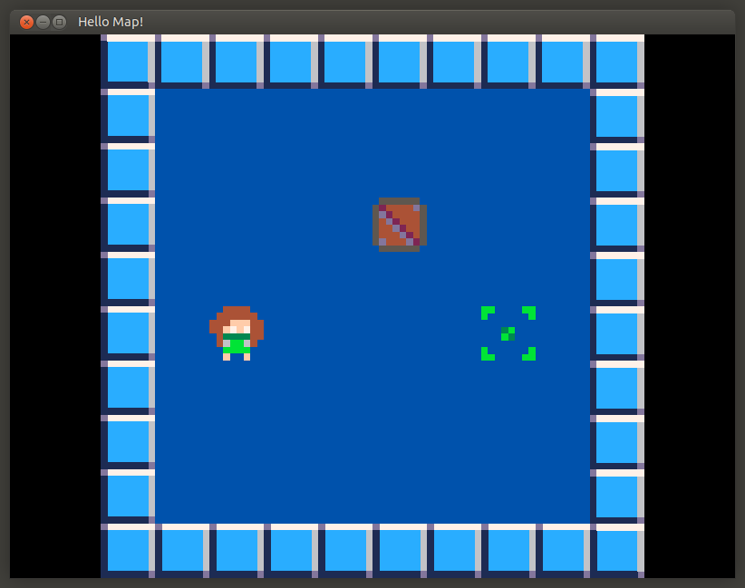

# libPMSDL

libPMSDL is a tiny PicoMapper map loader library for SDL3!



# TODO
- Implement draw_layer
- Implement some utilities such as get_tile set_time
- Other bs I'll figure out as I go lol

# Usage and Examples
The API is available inside the [header file](./LibP8M/include/p8m/map.h), it shows every function and description for the functions.

There is also a map rendering example provided [here](./Example/main.cpp).

# Compiling
Building libPMSDL is quite simple. All you need is vcpkg and a few dependencies.

> [!important]
> Vcpkg install instructions can be found [here](https://learn.microsoft.com/en-us/vcpkg/get_started/get-started?pivots=shell-bash)

Now, you are free to clone the repository.

Open your favourite terminal editor:
```bash
git clone https://github.com/EveMeows/libpmsdl
cd libpmsdl
```

## Linux
Linux specific installation instructions

### Prerequisities
You will need a few libraries and applications before compiling.
```bash
# Ubuntu
sudo apt install cmake make gcc g++ clang ninja automake libx11-dev libxft-dev libxext-dev libibus-1.0-dev libltdl-dev libtool

# Fedora
sudo dnf install cmake make gcc gcc-g++ clang ninja automake libX11-devel libXft-devel libXext-devel ibus-devel libtool-devel
```

### Building
Now, we can build the library
```bash
mkdir build; cd build

# Only build the library
cmake .. -G Ninja -DCMAKE_TOOLCHAIN_FILE=$VCPKG_ROOT/scripts/buildsystems/vcpkg.cmake -DCMAKE_BUILD_TYPE=Release

# build the library with the provided example.
cmake .. -G Ninja -DCMAKE_TOOLCHAIN_FILE=$VCPKG_ROOT/scripts/buildsystems/vcpkg.cmake -DCMAKE_BUILD_TYPE=Release -DLIBPMSDL_COMPILE_EXAMPLE=ON

# Compile the library
ninja
```

If you compiled the library with the example, a `Content` directory and `MapExample` executable will now be available. To run the example simply type `./MapExample`, and you're done!

## Windows
TODO

# License
GPL 3.0
